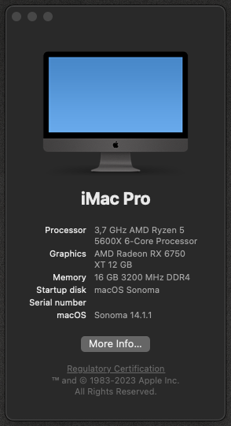

# OpenCore EFI for MSI B550M-Pro VDH WIFI Sonoma 14.1.1

# Specification

| **Component** | **Model** |
| ------------- | --------- |
| CPU | AMD Ryzen 3 3100 @ 3.6GHz |
| Motherboard | MSI B550M-Pro VDH WIFI |
| RAM | 8GB Corsair Vengeance LPX 3000mhz C16|
| Audio Chipset | Realtek® ALC892/ALC897 Codec |
| GPU | Radeon™ RX 480 G1 Gaming 8G |
| WiFi & Bluetooth | Intel® Dual Band Wireless-AC 3168 |
| Lan |  Realtek® 8111HN Gigabit LAN controller |
| OS Disk | Patriot 480GB SSD |

**macOS version**: 11.1 (19H2)  

**OpenCore version**: 0.6.4  

**SMBIOS**:  iMacPro1,1

## What works
- Audio (`alcid=28`)
- Ethernet
- USB
- Wi-Fi
- Bluetooth
- iMessage, FaceTime
- Input works fine with Logitech G430 Genuine USB Adaptor.

## Known issues
- Airdrop and Airplay.
- 3.5mm Jack microphone. (Tested no joy)

## Important
- It was hard to make Ethernet work. I had to go to info.plist file inside kexy and change "OSBundleRequired" to Root. The value should be System-Root by default. It did not work with default value. So, I changed it to Root. Now works perfect. 
- Please fill out PlatformInfo -> Generic -> MLB, SystemSerialNumber and SystemUUID on config.plist. 

How to: 
- Download [**GenSMBIOS**](https://github.com/corpnewt/GenSMBIOS) to generate unique SMBIOS information. Run it and select **Generate SMBIOS**, as model select **iMacPro1,1**.
- Open config.plist with [**ProperTree**](https://github.com/corpnewt/ProperTree) and go to PlatformInfo > Generic. Set MLB (Board Serial), SystemSerialNumber (Serial) and SystemUUID (SmUUID) to generated values.

## Credits
- Thanx to Hackintosh & Dortania Teams for all information

