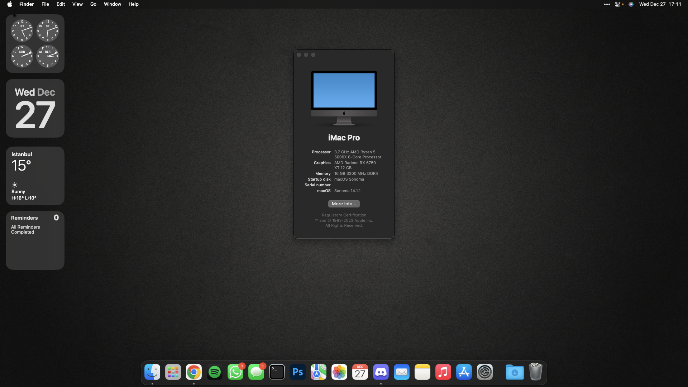

# OpenCore EFI for MSI B550M-Pro VDH WIFI Sonoma 14.1.1

# Specification

| **Component** | **Model** |
| ------------- | --------- |
| CPU | AMD Ryzen 5 5600X @ 3.7GHz |
| Motherboard | MSI B550M-Pro VDH WIFI |
| RAM | 2x8GB Apacer Panther Black DDR4 3200mhz C16|
| Audio Chipset | Realtek® ALC892/ALC897 Codec |
| GPU | AMD Radeon™ RX 6750 XT 12GB |
| WiFi & Bluetooth | Fenvi T919 PCI-E WiFi Adapter |
| Lan |  Realtek® 8111HN Gigabit LAN controller |
| OS Disk | Crucial CT2000P3PSSD8 P3 Plus 2TB PCIe4.0 NVMe M.2 |

**macOS version**: 14.1.1 (23B81)  

**OpenCore version**: 0.6.4  

**SMBIOS**:  iMacPro1,1

## What works
- Audio (`alcid=28`)
- Ethernet
- USB
- Wi-Fi
- Bluetooth
- iMessage, FaceTime
- Input works fine with Logitech G430 Genuine USB Adaptor.

## Known issues
- 3.5mm Jack microphone. (Tested no joy)

## Important
- Please fill out PlatformInfo -> Generic -> MLB, SystemSerialNumber and SystemUUID on config.plist.
- Fenvi T919 Network Card supports Airdrop, Bluetooth, Wifi and all continuity features.
- 

How to: 
- Download [**GenSMBIOS**](https://github.com/corpnewt/GenSMBIOS) to generate unique SMBIOS information. Run it and select **Generate SMBIOS**, as model select **iMacPro1,1**.
- Open config.plist with [**ProperTree**](https://github.com/corpnewt/ProperTree) and go to PlatformInfo > Generic. Set MLB (Board Serial), SystemSerialNumber (Serial) and SystemUUID (SmUUID) to generated values.

## Credits
- Thanx to Hackintosh & Dortania Teams for all information

